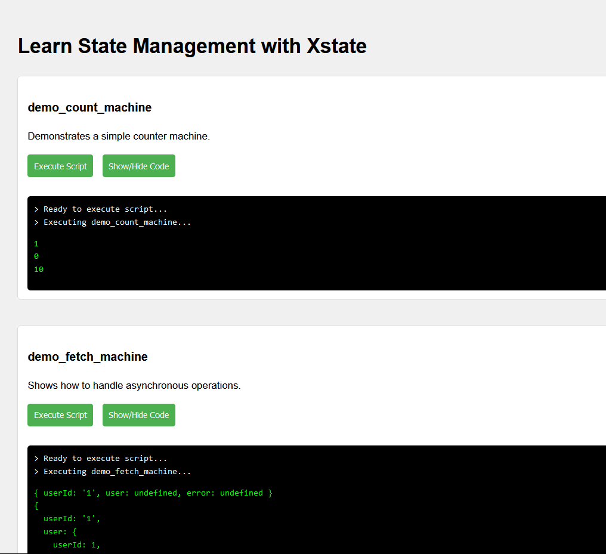
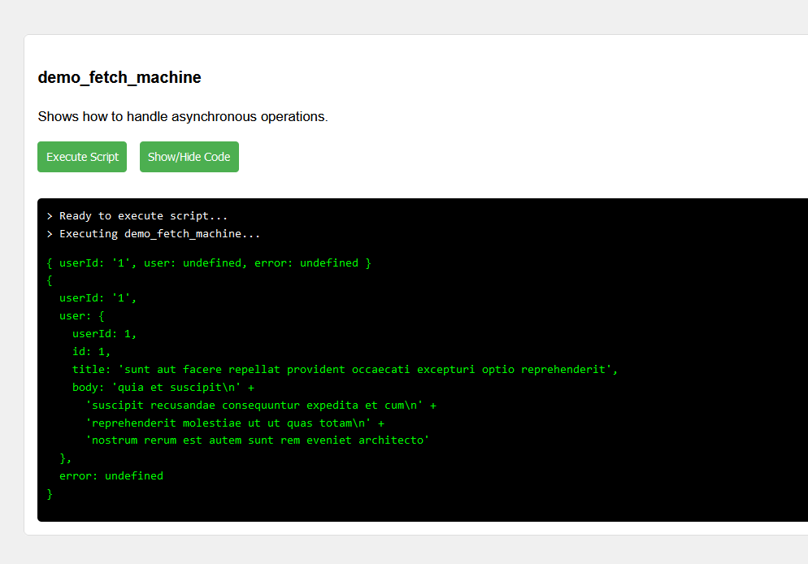
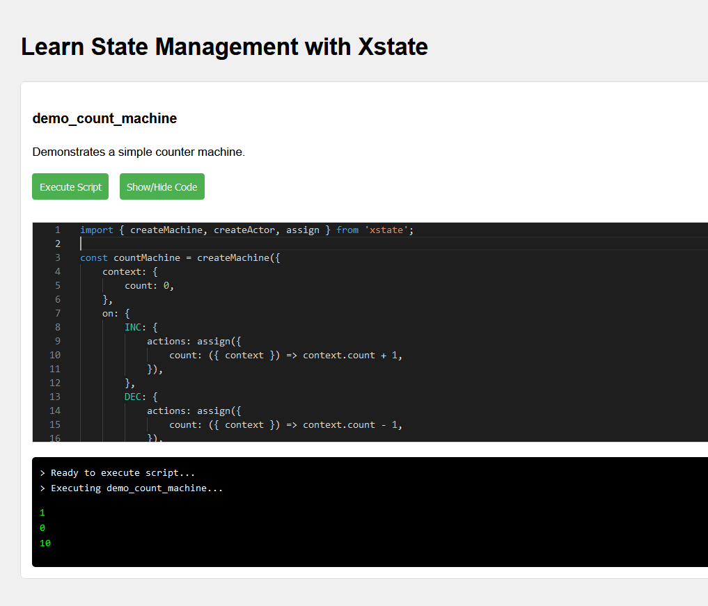

# learn state management with xstate

this project demonstrates state management concepts using the xstate library through interactive examples.

## demo scripts

### demo_count_machine

demonstrates a simple counter machine.

this example shows:
- basic state machine setup
- incrementing and decrementing a counter
- displaying machine output

### demo_fetch_machine 

shows how to handle asynchronous operations.

this example demonstrates:
- asynchronous state transitions
- handling api responses
- error states

## usage

each demo script has:
- an "execute script" button to run the example
- a "show/hide code" button to view the source

the console output shows the state machine's behavior when executed.

## code viewer

clicking "show/hide code" reveals the script source:

this allows examining the xstate implementation details.

## getting started

1. clone this repository
2. install dependencies
3. run the development server
4. open in your browser to interact with the demos

for more details on xstate, refer to the [official documentation](https://xstate.js.org/docs/).